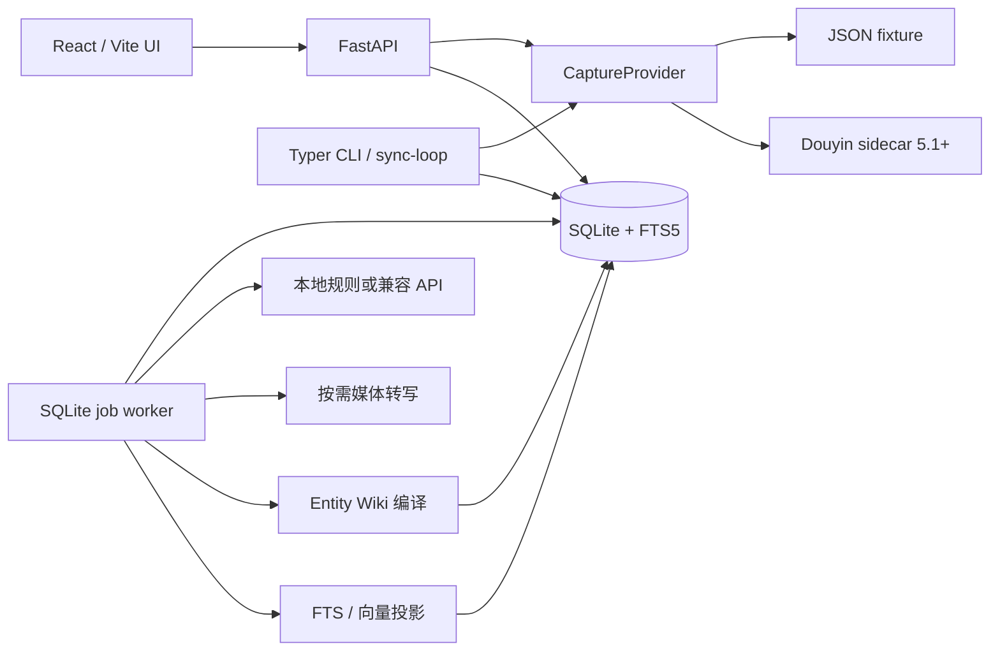

# Douyin Knowledge：当前实现架构与审查导览

本文描述 `exp/gpt-v1` 上**实际实现的 V1**。产品目标见 `PRODUCT_SPEC.md` 等原始设计；技术取舍见 `IMPLEMENTATION.md`。安装与演示命令以仓库根目录的 `README.md` 为准。

## 1. 当前能做什么

- 从合成 JSON fixture 导入收藏；也可通过配置好的 Douyin_TikTok_Download_API 5.1+ sidecar 同步收藏夹。后者只有模拟 HTTP 合约测试，**尚未用真实账号验证**。
- 在处理前按单视频、作者、收藏夹、内容类型、关键词执行策略。`metadata_only` 保留来源元数据，不进入正常知识问答。
- 将说明文字、提供的文字稿，以及有条件获取的语音转写保存为 Evidence；从中生成带来源和证据 ID 的 Claim、Entity、KnowledgeItem。
- 为 Entity 编译带修订和 Claim 支持关系的 Wiki；通过 SQLite FTS5、结构化匹配及向量投影检索；回答个人收藏问题并返回引用。
- 在本地 UI 提问、搜索、浏览来源和证据、查看处理与同步状态、管理规则、记录个人状态并回看“想去／想试／想学”的事项。

这是可在没有外部凭据时演示的主链路。它不等于所有原始设计能力均已实现。

## 2. 运行拓扑

后端是 Python 单用户本地应用，API、同步循环和 worker 是可分别启动的进程；它们共享 SQLite。数据库由六个 Alembic 迁移建立。媒体临时文件在转写后删除；远程视频地址保存在 `SourceAsset`，sidecar cookie 不进入本项目数据库。

代码入口：`backend/douyin_knowledge/api.py`、`cli.py`；主流程在 `capture.py`、`policy.py`、`service.py`、`retrieval.py`；模型在 `models.py`；Wiki 与索引分别在 `wiki.py`、`index.py`。

## 3. 数据边界与不变量

| 数据 | 作用 | 与其他数据的边界 |
| --- | --- | --- |
| `Source`、`SourceSnapshot`、`SourceCollectionMembership` | 当前平台元数据、去重与来源历史 | Source 不保存 AI 总结；当前收藏夹成员关系随完整同步更新，旧状态留在快照中。 |
| `ProcessingRule`、`PolicyDecision` | 处理控制与策略变更审计 | 策略在昂贵的抽取和转写之前执行。 |
| `Job`、`ProcessingRun` | 可重试任务与每次处理记录 | 重处理创建新 Run；`Source.current_run_id` 指向当前版本，旧版不覆写。 |
| `Evidence`、`Claim`、`EntityMention`、`Entity` | 原文证据、来源观点和对象身份 | `Claim → Evidence → Source` 可回溯；Claim 是来源说法，不是无来源事实。 |
| `UserState` | 用户自己的状态、评分和笔记 | 不覆盖创作者观点，也不作为 Claim 的归属。 |
| `WikiPage`、`WikiRevision`、`WikiSupport` | 可重建的编译视图 | Wiki 指向 Claim，不是唯一真相源。质量问题在 `WikiQualityEvent` 中记录。 |
| `VectorDocument`、`search_fts` | 检索投影 | 可从当前来源与 Claim 证据重建；不作为规范数据源。 |

抽取结果中的 Claim 必须引用本次 Evidence ID，并提供该证据中逐字存在的非空 quote；保存的 value 也必须出现在 quote 内。规则偏保守，会舍弃某些合理转述，以降低无证据说法进入个人知识库的风险。fixture 中的显式 Claim 只用于演示，并同样经过引文校验。

## 4. Capture → Answer 的实际流程

1. **Capture / Sync：**文件或 sidecar 提供规范化 `CapturedSource`。按 `(platform, external_id)` 去重，更新当前收藏夹成员关系，保存快照和同步结果。sidecar 的一次成功列表被视为完整快照：原来由 sidecar 同步、现在缺席的来源变成 `removed`，历史仍保留；同步失败不会执行移除判断。
2. **Policy：**来源规则优先；其余维度的 `always_process` 规则优先于排除规则，排除规则按作者、收藏夹、内容类型、关键词依次选取。决策变化被记录。`metadata_only` 和 `removed` 来源不参与正常检索与 Wiki 当前页。
3. **Queue：**允许处理的来源进入 SQLite Job 队列。worker 原子领取任务；错误持久化，指数退避，最多尝试三次。Source 内容变化会使旧观点暂时退出当前问答，直到新 Run 成功。
4. **Understand：**优先使用 caption／提供的 transcript。短 caption 且没有 transcript 时，如有媒体 URL 和可用 API key，可下载不超过 100 MiB 的 HTTPS 视频、用捆绑的 ffmpeg 提取音频并调用兼容的转写端点。转写失败但 caption 仍可用时降级处理并记录原因。抽取可使用配置的聊天模型；无凭据时使用确定性本地规则。处理深度与模型、证据和观点数量保存在 Run 中。
5. **Integrate：**通过标准化名称和类型保守地复用 Entity。Claim 与 KnowledgeItem 属于具体 Run。只从当前、可用的 Claim 编译 Entity Wiki 页；修订保存支持关系。`wiki-lint` 检查缺失、断裂或过期的支持，`wiki-fix` 通过新修订重编译可确定修复的页面。
6. **Retrieve / Synthesize：**检索结合 Source／Entity 匹配、FTS5 与向量相似度，再按问题线索筛选命中来源内的观点。FTS 纳入当前 Run 的 Claim 所引用的完整证据；向量输入截到 4,000 字符。明确提到个人收藏的问题使用 personal 范围；没有个人线索的问题使用 general 范围。个人回答无证据时明确说不足；配置模型后可基于候选 Claim 合成回答，引用 ID 仍受候选集约束。提问和引用摘要保存在 `Message`。
7. **Resurface：**用户主动标记的“想去／想试／想学”Entity 会与当前仍可用的来源观点一起展示。

## 5. 对原设计的主要取舍

| 原设计方向 | 当前实现 | 收益与代价 |
| --- | --- | --- |
| 更完整的物理模式与多类 Wiki 页面 | 小型关系模型、六个迁移、Entity Wiki | 主链路易于检查和重建；Concept／Topic／Synthesis 页及详细事件模型尚缺。 |
| LanceDB | SQLite JSON 向量投影，线性余弦比较 | 安装和备份简单；大规模收藏检索效率有限。无 API key 时是弱语义的本地哈希。 |
| ASR、OCR、Vision 分级增强 | 文本优先，必要时可做语音转写 | 避免每个视频都跑昂贵处理；OCR、关键帧和视觉尚未接入。 |
| 模型辅助的 Wiki 路由与集成 | 确定性 Entity 页编译 | 引用与修订容易审计；复杂跨来源综合能力有限。 |

## 6. 审查与运行证据

建议审查者先按 `README.md` 在空数据库运行迁移、fixture 同步和三个 `worker --once`，再问“我收藏的旺角日料人均多少？”。预期回答引用“约80港币”，并可沿 Claim、Evidence、Source 找回原始说明。

截至本文件更新时，本分支运行过：30 项后端测试、Ruff 检查、前端 TypeScript 检查与 `pnpm build`；从空 SQLite 数据库执行迁移和 fixture 完整演示，并验证从旧版本迁移到 0006。后端及前端开发服务都曾启动并通过 HTTP 检查。这些验证不能替代真实账号或真实模型调用。

前端还用本地浏览器和合成 fixture 人工走过提问及来源引用、搜索、来源证据、知识对象状态保存及回看、任务列表、同步记录、Wiki 来源支持链接，以及不存在页面的错误提示。界面为加载失败提供错误信息和重试入口，任务列表每 5 秒刷新。手机宽度下检查了首页和任务页的导航及内容布局。这是演示路径的交互验证，不是完整的跨浏览器或无障碍验收。

审查重点建议放在：策略反转与收藏夹移动、sidecar 来源消失／恢复、失败任务重试、旧 Run 与当前 Run 的隔离、Claim 引文校验、Wiki 支持关系、个人／通用问题边界，以及长转写内容的索引覆盖。对应测试位于 `backend/tests/`。

## 7. 尚未完成或尚未实测

- 真实 Douyin sidecar 账号、导入身份及私人收藏的联调；真实聊天／embedding／语音转写服务调用。已有 HTTP 或注入式模拟测试，不能视作生产联调。
- OCR、关键帧和 Vision；多类型 Wiki 页、模型驱动集成、成本台账、完整会话记忆。
- 大规模收藏的索引性能、真实中文搜索质量、模型回答质量和长时间同步运行稳定性评估。

需要真实验证时，在本机安全地配置 `DK_SIDECAR_*` 和 `DK_OPENAI_*`；不要把 cookie、API key 或私人收藏提交到 Git。测试后应记录实际 sidecar 版本、模型标识、样本规模、失败情况及成本，再决定是否扩大使用。
